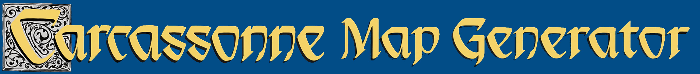
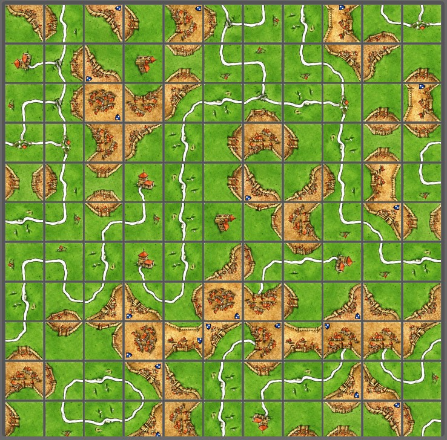
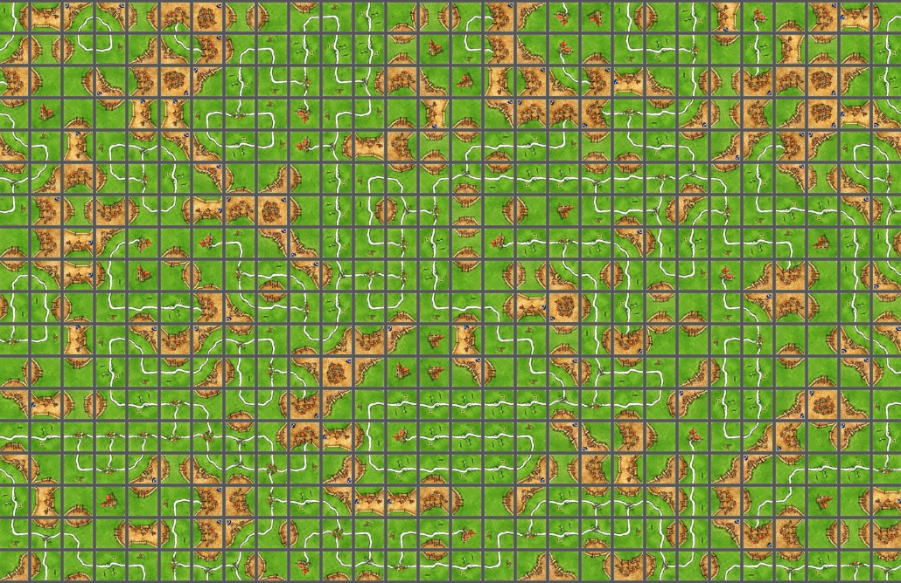

<p align="center">
  
</p>

# Carcassonne Map Generator

A web-based tool for generating custom Carcassonne game maps. Create beautiful, playable maps by automatically placing tiles that match each other perfectly.

## What is this?

This project generates random Carcassonne maps using the official game tiles. The smart algorithm ensures that tiles only connect where their edges match - roads connect to roads, cities to cities, and fields to fields. Perfect for creating new scenarios or exploring different map layouts!

## Features

- **Automatic tile placement** - Watch as the algorithm builds a map tile by tile
- **Smart matching** - Tiles only connect where their edges are compatible
- **Customizable grid size** - Create maps from small to large
- **Interactive controls** - Zoom in/out and pan around your map
- **Adjustable speed** - Control how fast the generation happens
- **Multiple starting positions** - Choose where the first tile is placed

## Examples

<p align="center">
  
  
</p>

## How to Use

1. **Open the application** - Simply open `index.html` in your web browser
2. **Set your preferences** - Adjust grid size, starting position, and generation speed
3. **Click "Generate"** - Watch as your map is built automatically
4. **Explore** - Use zoom and pan controls to examine your creation
5. **Clear and retry** - Generate new maps with different settings

## Getting Started

No complex setup required! Just open the HTML file in any modern browser. The application works entirely in your browser with no server needed.

For developers who want to modify the code:

```bash
npm install
npm run build
```

## How It Works

The generator uses a spiral algorithm to place tiles one at a time, always checking that the new tile's edges match with already-placed neighbors. Each tile can be rotated to find the best fit, creating realistic and playable maps every time.
